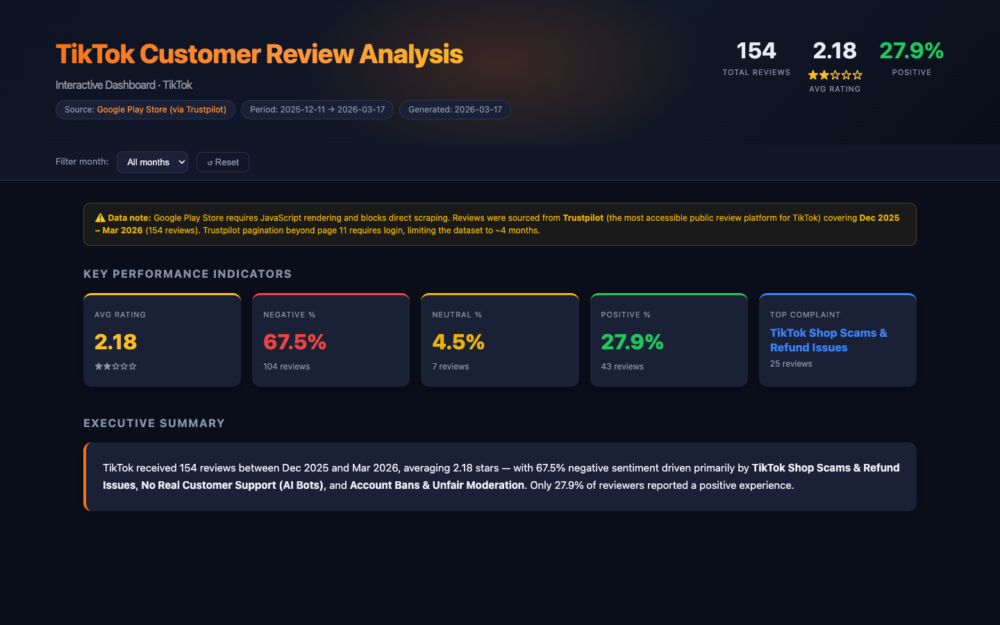

# Customer Review Analyst

**[🌐 Product Page](https://adrianwwwang.github.io/customer-review-analyst/)**

An [agent skill](https://docs.github.com/en/copilot/concepts/agents/about-agent-skills) that fetches, analyzes, and visualizes customer reviews into a polished, interactive report — in one conversation.

Works with **Claude Code**, **GitHub Copilot**, **Cursor**, **Codex**, **Kiro**, **OpenClaw**, and any tool that supports the open `SKILL.md` standard.

Give it a product review URL or just a product name, and it produces a self-contained HTML dashboard with trend charts, sentiment analysis, top complaint themes, verbatim quotes, and prioritized action items. Optionally generates PowerPoint slides and a PDF report.

---

## What it does

| Output | Description | Always? |
|--------|-------------|---------|
| **HTML dashboard** | Dark-theme interactive single-file report | Yes |
| **PowerPoint slides** | 7-slide deck for stakeholder presentations | Optional |
| **PDF report** | Static version of the dashboard | Optional |
| **Raw JSON** | Saved review data for future reuse | Optional |

**Example output** — TikTok analysis · 154 reviews · Dec 2025–Mar 2026 · 2.18 avg rating · 67.5% negative sentiment:



---

## Architecture

The skill is a single `SKILL.md` manifest that orchestrates the AI through a 6-step workflow:

```
User request
    │
    ▼
Step 1 ── Gather inputs
          URL or product name · time range · output formats · output directory
    │
    ▼
Step 2 ── Get review data
          WebFetch from URL  ──or──  WebSearch for product  ──or──  Load existing JSON
          Paginate to collect 50+ reviews · filter by time range · optionally save raw JSON
    │
    ▼
Step 3 ── Analyze (Python script written + run by the AI)
          ├── Sentiment classification  (star rating + text override)
          ├── Monthly aggregation       (avg rating, counts, sentiment %)
          ├── Complaint theme extraction (5–7 themes, 2–3 verbatim quotes each)
          └── Action item generation    (1 per theme, priority ranked)
    │
    ▼
Step 4 ── Generate HTML dashboard
          scripts/generate_html.py · Chart.js · dark theme · fully self-contained
    │
    ▼
Step 5 ── Optional outputs
          python-pptx → .pptx slides   │   weasyprint/pdfkit → .pdf
    │
    ▼
Step 6 ── Summary
          File paths · sentiment split · top 3 complaints · top 3 actions
```

**Key files:**

```
customer-review-analyst/
├── skills/
│   └── customer-review-analyst/
│       ├── SKILL.md                    # Skill definition — orchestration instructions
│       └── scripts/
│           └── generate_html.py        # HTML dashboard generator (~750 lines, Chart.js)
├── cursor/
│   └── rules/
│       └── customer-review-analyst.mdc # Cursor rules file
├── github-copilot/
│   └── copilot-instructions.md         # Drop into .github/copilot-instructions.md
├── .claude-plugin/
│   ├── plugin.json                     # Claude Code marketplace metadata
│   └── marketplace.json               # Claude Code marketplace registry
└── evals/
    └── evals.json                      # Evaluation test cases
```

**Runtime dependencies** (the AI installs these on demand via `pip`):

| Package | Purpose | Required? |
|---------|---------|-----------|
| Chart.js | Interactive charts in HTML | Auto — loaded from CDN |
| `python-pptx` | PowerPoint generation | Only for `.pptx` output |
| `matplotlib` | Chart images in slides | Only for `.pptx` output |
| `weasyprint` | HTML → PDF | Only for `.pdf` output |

---

## Installation

###  Claude

```bash
# Clone the repo
git clone https://github.com/adrianwwwang/customer-review-analyst.git

# Copy the skill to your Claude skills directory
cp -r customer-review-analyst/skills/customer-review-analyst ~/.claude/skills/
```

Restart Claude Code — the skill is auto-detected and available in all projects.

---

###  GitHub Copilot

#### VS Code

**Option A — Personal skill (available across all projects):**
```bash
cp -r customer-review-analyst/skills/customer-review-analyst ~/.copilot/skills/
```

**Option B — Project skill (repo-specific):**
```bash
mkdir -p your-project/.github/skills
cp -r customer-review-analyst/skills/customer-review-analyst your-project/.github/skills/
```

**Option C — Custom instructions (always-on, no skill system needed):**
```bash
cp customer-review-analyst/github-copilot/copilot-instructions.md your-project/.github/copilot-instructions.md
```

#### Eclipse

**Custom instructions:**
```bash
cp customer-review-analyst/github-copilot/copilot-instructions.md your-project/.github/copilot-instructions.md
```

#### Xcode

**Custom instructions:**
```bash
cp customer-review-analyst/github-copilot/copilot-instructions.md your-project/.github/copilot-instructions.md
```

#### JetBrains

**Option A — Personal skill (available across all projects):**
```bash
cp -r customer-review-analyst/skills/customer-review-analyst ~/.copilot/skills/
```

**Option B — Project skill (repo-specific):**
```bash
mkdir -p your-project/.github/skills
cp -r customer-review-analyst/skills/customer-review-analyst your-project/.github/skills/
```

**Option C — Custom instructions (always-on, no skill system needed):**
```bash
cp customer-review-analyst/github-copilot/copilot-instructions.md your-project/.github/copilot-instructions.md
```

---

###  Cursor

```bash
mkdir -p .cursor/rules
curl -o .cursor/rules/customer-review-analyst.mdc \
  https://raw.githubusercontent.com/adrianwwwang/customer-review-analyst/main/cursor/rules/customer-review-analyst.mdc
```

The rule is context-triggered — Cursor activates it automatically when your request matches the skill description.

---

###  Codex

**Global install (all projects):**
```bash
mkdir -p ~/.codex/skills/customer-review-analyst
curl -o ~/.codex/skills/customer-review-analyst/SKILL.md \
  https://raw.githubusercontent.com/adrianwwwang/customer-review-analyst/main/skills/customer-review-analyst/SKILL.md
```

**Project-level install:**
```bash
mkdir -p .agents/skills/customer-review-analyst
curl -o .agents/skills/customer-review-analyst/SKILL.md \
  https://raw.githubusercontent.com/adrianwwwang/customer-review-analyst/main/skills/customer-review-analyst/SKILL.md
```

---

###  Kiro

**Option A — Steering file (always-on, recommended):**
```bash
mkdir -p .kiro/steering
curl -o .kiro/steering/customer-review-analyst.md \
  https://raw.githubusercontent.com/adrianwwwang/customer-review-analyst/main/skills/customer-review-analyst/SKILL.md
```

**Option B — Agent Skill (context-triggered):**
```bash
mkdir -p .kiro/skills/customer-review-analyst
curl -o .kiro/skills/customer-review-analyst/SKILL.md \
  https://raw.githubusercontent.com/adrianwwwang/customer-review-analyst/main/skills/customer-review-analyst/SKILL.md
```

---

###  OpenClaw

**Global install (all projects):**
```bash
mkdir -p ~/.openclaw/skills/customer-review-analyst
curl -o ~/.openclaw/skills/customer-review-analyst/SKILL.md \
  https://raw.githubusercontent.com/adrianwwwang/customer-review-analyst/main/skills/customer-review-analyst/SKILL.md
```

**Project-level install:**
```bash
mkdir -p skills/customer-review-analyst
curl -o skills/customer-review-analyst/SKILL.md \
  https://raw.githubusercontent.com/adrianwwwang/customer-review-analyst/main/skills/customer-review-analyst/SKILL.md
```

---

## Usage

Once installed, speak naturally. Trigger phrases:

- `"Analyze reviews for [product name or URL]"`
- `"What are customers saying about [product]?"`
- `"Give me a review dashboard for [URL]"`
- `"Summarize customer complaints for [product]"`
- `"Product feedback summary for [URL]"`

### Example prompts

```
Analyze customer reviews at https://www.amazon.com/dp/B07S829LBX for the last 6 months.
HTML only is fine.
```

```
What are customers saying about Bose QuietComfort 45 headphones?
Save the data and also generate slides.
```

### What the AI will ask you

Before starting, it gathers **5 inputs** up front:

| # | Question | Default |
|---|----------|---------|
| 1 | Data source — URL, product name, or path to existing JSON | — |
| 2 | Time range | Last 6 months |
| 3 | Output formats — HTML (always), PPTX, PDF | HTML only |
| 4 | Review data — fetch & save / fetch only / load existing | Fetch only |
| 5 | Output directory | Current working directory |

### Output file structure

```
[output-dir]/
├── customer_review_report_[product]_[date].html    ← always
├── customer_review_slides_[product]_[date].pptx    ← if requested
├── customer_review_report_[product]_[date].pdf     ← if requested
├── reviews_[product]_[date].json                   ← if "save data" chosen
├── analysis_results.json
└── scripts/
    ├── generate_html.py
    ├── analyze_reviews.py
    └── generate_slides.py
```

---

## Supported review sources

Works best with:
- **Trustpilot** — `trustpilot.com/review/[company-slug]`
- **Amazon** — product pages with `#customerReviews` anchor
- **Google Play Store** — may fall back to Trustpilot for JS-heavy pages
- **Apple App Store** — via direct app page URL

If a site blocks scraping, the AI will suggest alternative platforms for the same product.

---

## Contributing

Pull requests welcome. For major changes, please open an issue first.

---

## License

MIT © [adrianwwwang](https://github.com/adrianwwwang)
